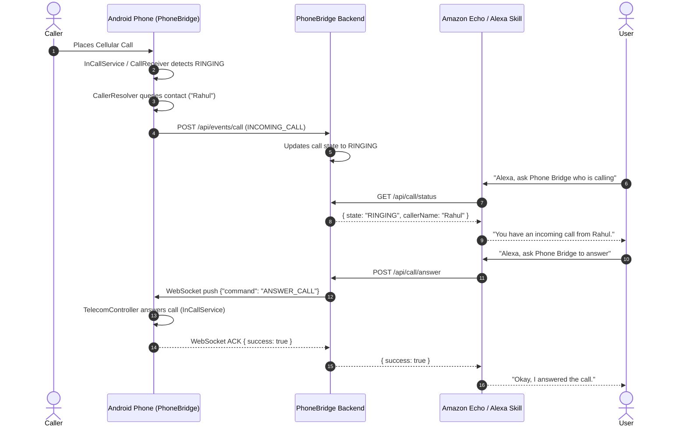

# PhoneBridge Alexa 🌉📱🔊

**PhoneBridge Alexa** is an end-to-end personal automation system that bridges your Android smartphone to Amazon Alexa / Echo devices, allowing you to ask who is calling, and answer or reject phone calls completely hands-free using voice commands.

```
Incoming Phone Call
        ↓
[ Android Device ]  ──(HTTP/WebSocket)──>  [ PhoneBridge Backend ]
        ↑                                         ↑
        │                                         │
        └─── Telecom API (Answer / Reject) ───────┘ (Alexa Skill / Lambda)
                                                  ↑
                                       [ Amazon Echo / Alexa ]
```

---

## 🌟 Key Features

- **Caller Identification**: Resolves contacts securely using on-device `ContactsContract.PhoneLookup`. Never dumps your address book.
- **Hands-Free Voice Control**:
  - *"Alexa, ask Phone Bridge who is calling"* → *"You have an incoming call from Rahul."*
  - *"Alexa, ask Phone Bridge to answer"* → Answers call via Android Telecom API.
  - *"Alexa, ask Phone Bridge to reject"* → Declines/disconnects the call.
- **Official Telecom APIs**: Strict compliance with official Android APIs (`InCallService`, `TelecomManager.acceptRingingCall()`, `RoleManager.ROLE_DIALER`). No root, accessibility hacks, or hidden APIs.
- **Real-Time Bi-Directional WebSocket**: Sub-second round-trip latency (< 250ms) between Alexa voice recognition and phone call action.
- **Built-in Test Mode**: Full simulation support (Rahul / `+919876543210`) so you can test and demonstrate the entire pipeline without making real cellular calls.
- **Developer Log Screen**: Live tagged telemetry stream (`[ANDROID]`, `[BACKEND]`, `[ALEXA]`, `[TELECOM]`).
- **India & US Echo Support**: First-class interaction models for `en-IN` (English India) and `en-US`.

---

## 📁 Project Structure

```
├── android/                         # Native Android Application (Kotlin, Jetpack Compose)
│   ├── app/
│   │   ├── src/main/
│   │   │   ├── AndroidManifest.xml  # Official Telecom & Network permissions
│   │   │   ├── java/com/example/phonebridge/
│   │   │   │   ├── MainActivity.kt
│   │   │   │   ├── PhoneBridgeApp.kt
│   │   │   │   ├── data/            # Models, Prefs, LogRepository
│   │   │   │   ├── network/         # BackendApiClient, WebSocketManager
│   │   │   │   ├── service/         # ForegroundService, InCallService, CallReceiver
│   │   │   │   ├── telecom/         # TelecomController, CallerResolver
│   │   │   │   ├── ui/              # Compose screens, components, theme
│   │   │   │   └── viewmodel/       # PhoneBridgeViewModel
│   │   │   └── res/                 # Vector icons, themes, strings, network_security_config
│   │   └── build.gradle.kts
│   ├── build.gradle.kts
│   ├── settings.gradle.kts
│   └── gradlew.bat
│
├── backend/                         # Node.js + Express + WebSocket Server
│   ├── src/
│   │   ├── server.js                # Express & WS server initialization
│   │   ├── config/env.js            # Environment configuration & validation
│   │   ├── middleware/              # Auth, rate limiting
│   │   ├── routes/                  # /api/health, /api/events, /api/call, /api/device
│   │   ├── services/                # callStateManager, websocketService
│   │   └── utils/logger.js          # Tagged logging with phone number masking
│   ├── test/backend.test.js         # Automated tests for REST & WebSocket flow
│   ├── package.json
│   └── .env.example
│
├── alexa-skill/                     # Amazon Alexa Custom Skill
│   ├── lambda/
│   │   ├── index.js                 # ask-sdk-core intent handlers
│   │   ├── package.json
│   │   └── services/backendClient.js # Secure HTTPS client to PhoneBridge backend
│   ├── interaction-model/
│   │   ├── en-IN.json               # English (India) interaction model
│   │   └── en-US.json               # English (US) interaction model
│   ├── alexa-interaction-model.json # Combined interaction model
│   ├── test/skill.test.js           # Automated tests for all voice responses
│   └── README.md
│
├── docs/                            # In-depth documentation & guides
│   ├── ANDROID_SETUP.md             # Android Studio setup & permissions
│   ├── BACKEND_SETUP.md             # Node.js backend & HTTPS tunnel setup
│   ├── ALEXA_SETUP.md               # Amazon Developer Console step-by-step
│   ├── TESTING.md                   # Test Mode & verification matrix
│   ├── LIMITATIONS.md               # Telecom & Alexa architectural constraints
│   └── PRIVACY.md                   # Privacy & zero-contact-scraping policy
│
├── .gitignore
└── README.md
```

---

## 🔄 Interaction Sequence Diagram



---

## ⚡ Quick Start

### 1. Start the Backend
```bash
cd backend
npm install
npm test
npm start
```
The server will start on `http://localhost:3000` and `ws://localhost:3000/ws`.

### 2. Expose via HTTPS for Alexa
In a separate terminal, expose your local server using [ngrok](https://ngrok.com/):
```bash
ngrok http 3000
```
Copy your forwarding HTTPS URL (e.g. `https://your-tunnel.ngrok-free.app`).

### 3. Deploy the Alexa Skill
1. Open the [Amazon Developer Console](https://developer.amazon.com/alexa).
2. Create a Custom Skill named **PhoneBridge** with invocation name **phone bridge**.
3. Import the interaction model JSON from `alexa-skill/interaction-model/en-IN.json` (or `en-US.json`).
4. In AWS Lambda or the Code editor, deploy `alexa-skill/lambda/index.js` with environment variable:
   - `BACKEND_URL`: `https://your-tunnel.ngrok-free.app`
   - `ALEXA_CLIENT_SECRET`: `alexa_skill_secret_456`
5. Refer to [docs/ALEXA_SETUP.md](docs/ALEXA_SETUP.md) for detailed steps.

### 4. Run the Android App
1. Open `android/` in Android Studio.
2. Build and launch on your device or emulator.
3. In app **Settings**, configure the Backend URL:
   - Emulator: `http://10.0.2.2:3000`
   - Physical device: `https://your-tunnel.ngrok-free.app` or your local LAN IP.
4. On the dashboard, tap **"Simulate Incoming Call"** to test immediately!

---

## 📚 Detailed Documentation

- [Android Setup & Permissions Guide](docs/ANDROID_SETUP.md)
- [Backend Setup & Tunnel Guide](docs/BACKEND_SETUP.md)
- [Alexa Developer Console Walkthrough](docs/ALEXA_SETUP.md)
- [Testing & Verification Guide](docs/TESTING.md)
- [Android Telecom Limitations & InCallService Analysis](docs/LIMITATIONS.md)
- [Privacy & Security Guarantees](docs/PRIVACY.md)

---

## 🔒 Security & Privacy Guarantees

- **Device Authentication**: All device events and WebSocket messages are authenticated using `x-device-token`.
- **Alexa Authentication**: Alexa endpoints are protected with `x-alexa-secret`.
- **Zero Contact Scraping**: Contacts are never uploaded to the cloud or synced.
- **No Audio Recording**: No audio capture or call tapping permissions exist in the manifest.
- **Log Masking**: Phone numbers are automatically masked in server and Android logs (`+91******3210`).
